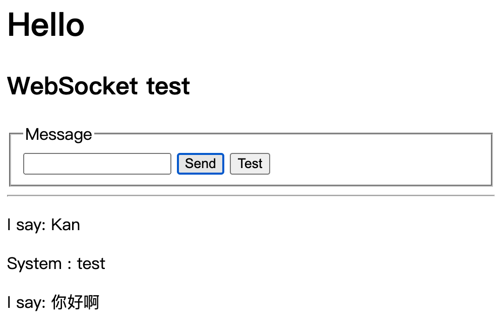
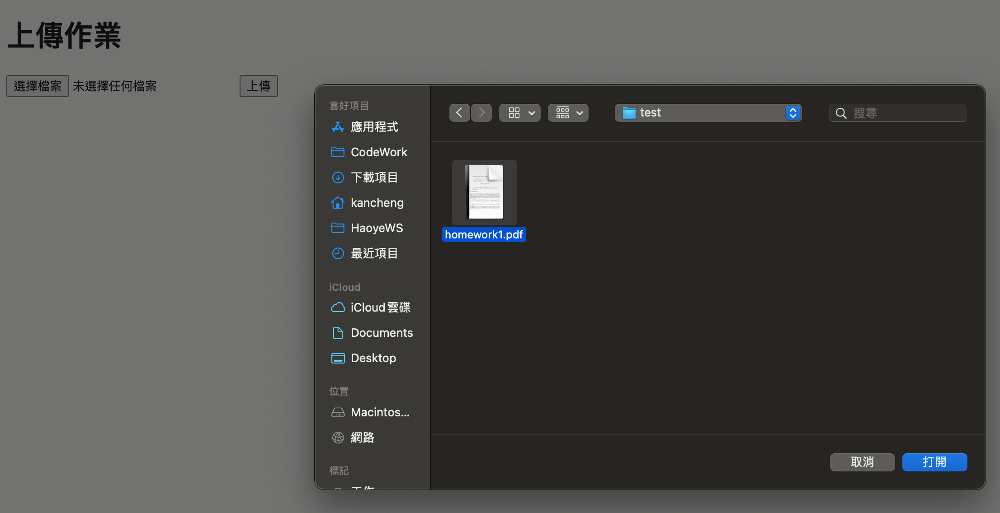
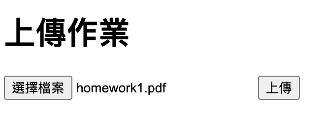
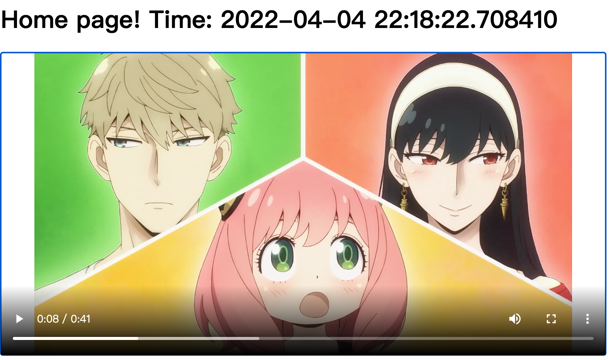

# 2022-dip-final-report-for-deeplearning-system

## Details

面向網路教學的聽課狀態視頻分析系統

## Demo

### 1. Check


### 2. Chat



### 3. File





### 4. Video



### 5. Streaming


## 思路

1. 使用疲勞駕駛的神經網路模型

2. YOLO 辨識人臉

3. Vue 前端 & Python 後端 & Pytorch

## 紀錄

1. Flask Yolov5 VUE

使用 Pytorch CPU 版本，Python 3.9.0

```
pip install flask
pip3 install torch==1.9.0 torchvision==0.10.0 torchaudio==0.9.0
pip install opencv-python   
pip install opencv-contrib-python
pip3 install pyyaml
pip install matplotlib
pip install scipy
pip install tqdm
```

2. Flask & SocketIO

```
pip3 install flask-socketio
pip install flask-wtf
pip install eventlet
pip install gevent
```

## Reference

1. Flask Yolov5 VUE : https://github.com/Sharpiless/Yolov5-Flask-VUE

2. Flask Streaming : https://github.com/snoopy831002/flask-streaming

3. Flask SocketIO Chat : 

- https://github.com/snoopy831002/Flask-SocketIO-Chat

- https://ithelp.ithome.com.tw/articles/10269552

- https://codeburst.io/building-your-first-chat-application-using-flask-in-7-minutes-f98de4adfa5d

4. eventlet & gevent :

- https://stackoverflow.com/questions/60991897/websocket-transport-not-available-install-eventlet-or-gevent-and-gevent-websock


5. File : 

- https://swf.com.tw/?p=1730

